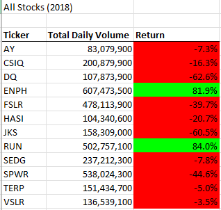
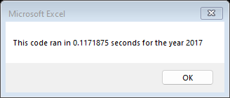
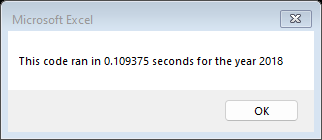
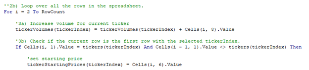
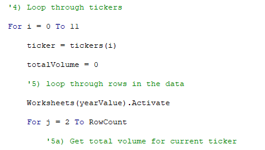

#Stock Analysis Module 2 UofT Data bootcamp

##Overview of Project
###Purpose

The client, Steve, is helping his parents do some research on the stock market. He is looking for an Excel workbook that can do analysis on multiple stocks for him. Using VBA script a custom code can be applied to the data to perform the analysis. Two scripts are used in this project, one based on analysis of a single ticker and another based on multiple tickers refactored to fit the source data.

## Results

Using both scripts, the same results are shown below for the years 2017 and 2018 for the given data on 12 different stocks.

The difference between the two different scripts is the time it takes to run as shown below.

Execution time for refactored script

Execution time for previous script

The execution time for the refactored script is shorter because it is written to loop through the data once. The previous code was modified from script written for a single ticker and so it loops through the data for every instance of a unique ticker. The start of the for loops in the script are shown below to show this difference in approach.

Refactored for loop

Previous for loop

##Summary

For this project, two approaches were used one starting from scratch and the other refactoring code that was given. Refactoring code is a good example of putting the concept of modularity to good use. It can save the coder time because they can copy and paste working code from one project to another. A disadvantage to refactoring code is that code written for one project may not be optimal for another project.

For this specific project, the refactored VBA script outperforms the original script in execution time as discussed in results. This stems from the number of tickers in the data as the refactored script loops through the data once and the original loops through 12 times. The refactored script is good for projects where you know the tickers you are interested in and the original script can be modified to analyze tickers as they appear in the data. In this project the 12 tickers are hard coded into the script.
